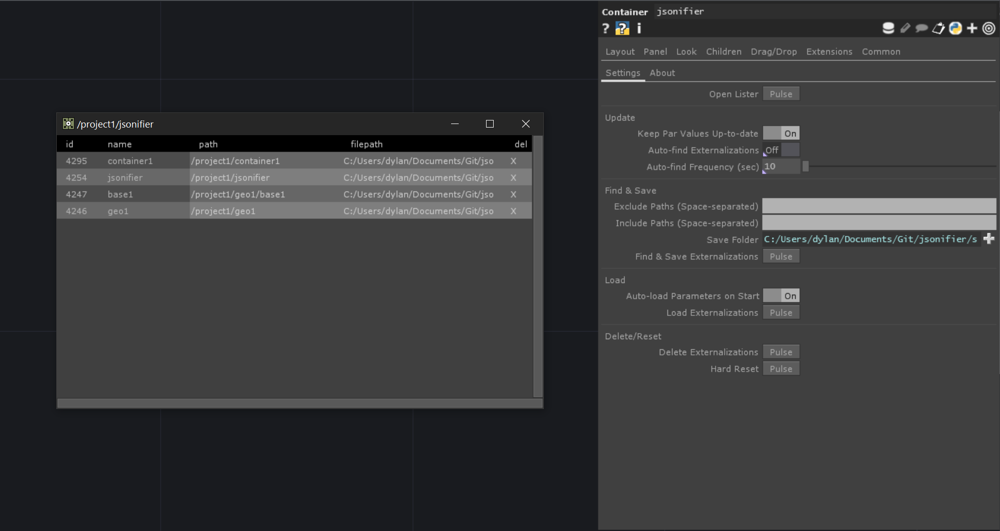

# :package: jsonifier

### Auto-save/load custom pars to/from external json files in TouchDesigner
#### :floppy_disk: TouchDesigner 2022.25370 (Windows)
#### :floppy_disk: Current version 0.4.0

## Overview

jsonifier is a TouchDesigner component that autosaves all (or specified) custom parameters in a project to external `JSON` files, which can be restored on project relaunch, relinquishing the need to `ctrl-s` in production/multi-machine environments.

## Features

### Exclude Paths
Strings in the Exclude Paths par are ignored (blacklisting method). For example, `folderTabs buttonMomentary` will ignore all custom pars on and inside of those `COMPs`.

### Include Paths 
Strings in the `Include Paths` par, when present, are considered while everything else in the project is ignored (whitelisting method). This will always override the `Exclude Paths` par.

### Auto-load
`JSON` files are reloaded on project launch so settings are retained without having to `ctrl-s` `toe` files. This option can be turned off in the jsonifier `Settings` parameter page.

### Auto-save
Custom parameter attributes and values are kept up-to-date by default in each `JSON` file via a `parameterexecuteDAT`, added to every `COMP` found with custom parameter attributes. This option can always be turned off in the jsonifier `Settings` parameter page, `Keep Par Values Up-to-date`.

### Auto-find
Custom parameter OPs can automatically be discovered in timed intervals while the project is running during development. This setting can then be turned off to reduce compute during production.

## Usage

1. (OPTIONAL) Add any strings you want to exclude from externalization. For example, if you do not want to include any COMP with the name `folderTabs`, add `folderTabs` to the Exclude Paths par.

>> Use single-space separation (`apples oranges bananas`).

2. (OPTIONAL) Add any strings you want to include from externalization. For example, if you want to include only COMPs with the name 'settings', add 'settings' to the Exclude Paths par. 

3. Specify the folder you want the externalizations to be saved into. Note that if the folder does not exist, it will be created.

>> If you want to change the folder after externalizing, note that the old folder contents will not be deleted.

>> Also note that expressions can be used (`project.folder + '/lib'`, for example).

4. Click on Find & Save Externalizations to externalize all parameters. The component will loop through the entire project until all settings are saved as external `JSON` files.

>> Note that you can also call `op.jsonifier.Save()` from anywhere in your network to perform a save.

5. Once externalized, parameters will automatically update as they are adjusted via a `parexecDAT` that is automatically added to every found `COMP`.

6. Save out your `toe` so jsonifier is retained.

7. When the project is relaunched, jsonifier will automatically reload all custom par settings from the external `JSON` files.

>>: This can be called manually via the Load Externalizations button in jsonifier `Settings`.

8. To delete a configuration, click the Delete Externalizations button. This will remove all `JSON` `textDATs`, external `JSON` files and `parexecDATs`.

>> For debugging, the Reset button deletes only the textDATs in the jsonifier component, and ignores externalized `JSON` files.